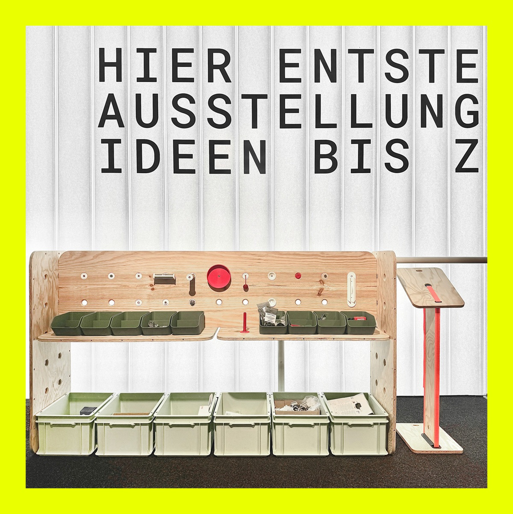

# SYSTEM

All exhibits are based on a modular system. We have developed a range of connection solutions for 3D printing. The system is also compatible with the ITEM D30 system and can be expanded.

Here you can find information and materials about the construction system used throughout the exhibition.

